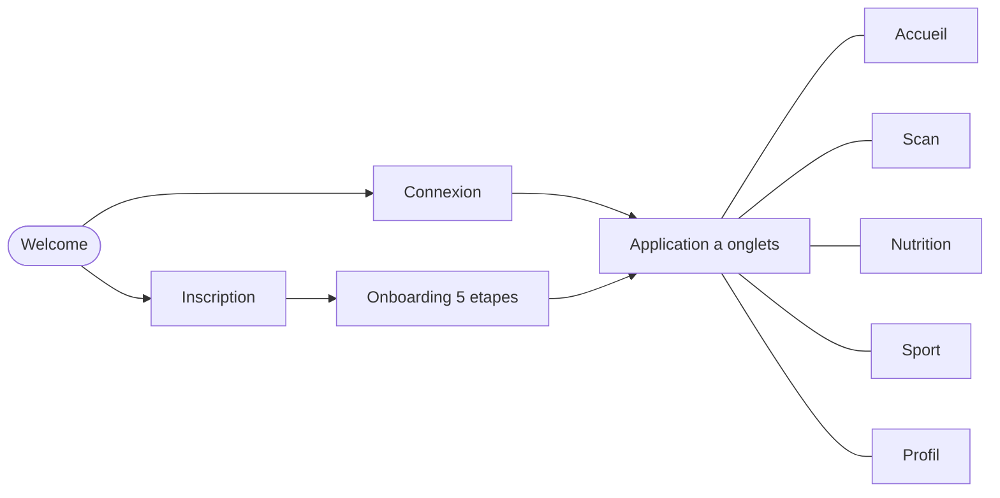

# Application mobile (MSPR3 / TPRE601)

Ce document presente l'application mobile HealthAI Coach prevue par le cahier des charges
de la MSPR3 : un client Android / iOS de la plateforme, porteur a terme du mini reseau
social. L'application est developpee par un membre de l'equipe dans le depot
`whitefoxxyt/MSPR-HealthAI-Coach-Mobile`. Le document decrit la stack, l'architecture,
l'integration aux services de la plateforme et la conteneurisation, puis fait le point
sur la couverture du besoin et le reste a faire.

Le document reste factuel : il decrit la version presente dans le depot a la date de
redaction (11/06/2026) et signale explicitement ce qui n'est pas encore livre.

## 1. Vue d'ensemble

L'application est un client mobile multiplateforme : une seule base de code TypeScript
produit les cibles Android et iOS via Expo / React Native. Dans sa version actuelle,
elle couvre le parcours de coaching de la plateforme :

- creation de compte et connexion aupres du service `auth` ;
- onboarding en 5 etapes (objectif, profil physique, niveau d'activite, preferences
  alimentaires, preferences sportives) ;
- tableau de bord quotidien (calories, macronutriments, seances) ;
- scan de repas par photo, envoyee au service `ai-nutrition` pour analyse ;
- plans nutritionnels et recommandations sportives personnalises ;
- profil utilisateur : suivi du poids (graphique 14 jours, IMC) et panneau de
  parametres (modification du profil, de l'objectif et des preferences, deconnexion).

Le module mini reseau social (flux de publications, likes / commentaires) n'est pas
present dans cette version : l'etat detaille et le reste a faire sont en section 6.

## 2. Stack technique

| Couche | Technologie |
|--------|-------------|
| Framework | Expo 54 + React Native 0.81 (nouvelle architecture activee) |
| Langage | TypeScript 5.9 |
| Navigation | Expo Router 6 (routage par fichiers, routes typees) |
| Etat global | React Context (`store/AppContext.tsx`) + AsyncStorage (persistance de la session et du profil) |
| Acces reseau | `fetch`, centralise dans un client API unique (`services/apiClient.ts`) |
| Medias | expo-image-picker (prise de photo pour l'analyse de repas) |
| UI | composants maison (`components/ui/`), design system sombre "Midnight Health", animations Reanimated, graphiques React Native SVG |

## 3. Architecture de l'application

Trois groupes d'ecrans, organises par le routage fichier d'Expo Router :

```
app/
├── (auth)/         welcome, login, register
├── (onboarding)/   goal, physical, activity, diet, sport-prefs
└── (tabs)/         index (accueil), scan, nutrition, sport, profile
```



Points de structure :

- L'etat global (profil, progression, session) vit dans `AppContext` et est persiste
  dans AsyncStorage : la session survit au redemarrage de l'application.
- Le hook `useHealthAI` (`hooks/useHealthAI.ts`) centralise les appels aux services IA
  (analyse de repas, generation de plan, recommandations) ainsi que les etats de
  chargement et d'erreur.
- `utils/dataTransformers.ts` convertit les reponses des APIs vers le format interne
  de l'application.
- Les maquettes (24 ecrans) et le design system sont versionnes dans le depot :
  `assets/design/wireframes.html` et `assets/design/design-system.html`.

## 4. Integration a la plateforme

L'application consomme les memes services que le front web, avec le meme modele
d'authentification (better-auth + JWT, voir `architecture-deploiement.md` section 3).
Les URLs des services sont configurables par variables d'environnement ; par defaut,
l'application vise une stack locale (le deploiement decrit dans ce dossier).

| Service | URL par defaut | Endpoints consommes |
|---------|----------------|---------------------|
| auth (:3000) | `http://localhost:3000/api` | authentification, `/session`, `/jwt` |
| api (:8080) | `http://localhost:8080/api` | `/users/me`, `/workouts`, `/nutrition` |
| ai-nutrition (:8001) | `http://localhost:8001/api/v1` | `/analyze-meal`, `/generate-meal-plan`, `/nutrition-goals/me`, `/meal-analyses/me`, `/meal-plans/me` |
| reco-fitness (:8002) | `http://localhost:8002/api/v1` | `/recommendations`, `/fitness-profile`, `/program-history` |

Flux d'authentification :

1. connexion ou inscription aupres du service `auth` (cookies de session better-auth,
   requetes en `credentials: include`) ;
2. recuperation d'un JWT via `GET /api/jwt` ;
3. appels aux services metier avec `Authorization: Bearer <jwt>` ; le JWT est conserve
   dans AsyncStorage.

Particularite Android : l'emulateur joint l'hote via `10.0.2.2` au lieu de
`localhost` ; le client API gere ce cas automatiquement (`Platform.OS`).

Point de vigilance : le client appelle `/api/auth/login`, `/api/auth/signup` et
`/api/auth/logout`, alors que le service `auth` expose les routes better-auth
(`/api/auth/sign-in/email`, `/api/auth/sign-up/email`, `/api/auth/sign-out`). Les
routes `/session` et `/jwt` sont, elles, deja alignees. Cet alignement des routes
d'authentification fait partie du reste a faire (section 6).

## 5. Conteneurisation, execution et qualite

Le depot fournit un `Dockerfile` pour un environnement de developpement reproductible :
image `node:20-alpine`, installation des dependances, ports Expo `19000-19006` exposes,
demarrage du serveur de developpement (`npx expo start --lan --minify`).

A la difference des 8 services de la plateforme, l'application mobile est un client :
elle s'execute sur le terminal de l'utilisateur (Expo Go en developpement, build natif
Android / iOS ensuite) et n'apparait donc pas dans la stack Docker Compose. Le conteneur
sert le bundler aux appareils du reseau local, pour le developpement et la demonstration.

Commandes :

```bash
npm install
npm start            # serveur de developpement Expo
npm run android      # cible Android
npm run ios          # cible iOS
npm test             # eslint + tsc --noEmit
```

Etat des verifications au 11/06/2026 (`npm test`) : la verification de types signale
9 erreurs (3 fichiers) et le lint 4 erreurs et 19 avertissements, concentres en
particulier sur un composant de demonstration (`AIFeaturesDemo.tsx`). L'application
se lance via Expo (le bundler ne bloque pas sur les types) ; la correction de ces
erreurs et la mise en place d'une chaine CI font partie du reste a faire.

## 6. Couverture du besoin et reste a faire

Etat par rapport au besoin exprime pour l'application mobile (cahier des charges,
sections III.6 et IV.1) :

| Besoin | Etat dans la version actuelle |
|--------|-------------------------------|
| Compatibilite Android et iOS | Couvert : base de code unique Expo / React Native, cibles Android et iOS |
| Panneau de controle des parametres utilisateur | Partiel : modification du profil physique, de l'objectif et des preferences, deconnexion (onglet Profil). Le nom d'affichage (defini a l'inscription) et la photo de profil ne sont pas encore modifiables. |
| Consultation des publications sur un flux unique | Non livre : module reseau social en cours de developpement |
| Ajout de publications texte et / ou medias | Non livre. La brique de capture photo existe (expo-image-picker, utilisee par le scan de repas), pas encore le flux de publication. |
| API et BDD de gestion des publications et medias | Non livre : a construire avec le module reseau social |

Reste a faire identifie :

- module reseau social cote application : flux unique de publications, creation de
  publications texte et / ou medias, likes et commentaires, nom d'affichage et photo
  de profil modifiables ;
- API et BDD dediees a la gestion des publications et des medias associes, avec un
  stockage objet pour les fichiers (MinIO, outil recommande par le cahier des charges) ;
- alignement des routes d'authentification du client sur celles de better-auth
  (section 4) ;
- correction des erreurs de typecheck / lint et mise en place d'une chaine CI sur le
  depot (lint, verification de types, build), sur le modele des 8 autres depots
  (`CICD.md`) ;
- une fois le backend publications disponible : raccordement a l'orchestration Compose,
  au monitoring, aux sauvegardes et au deploiement continu de la plateforme
  (`MSPR-Deploy`).
