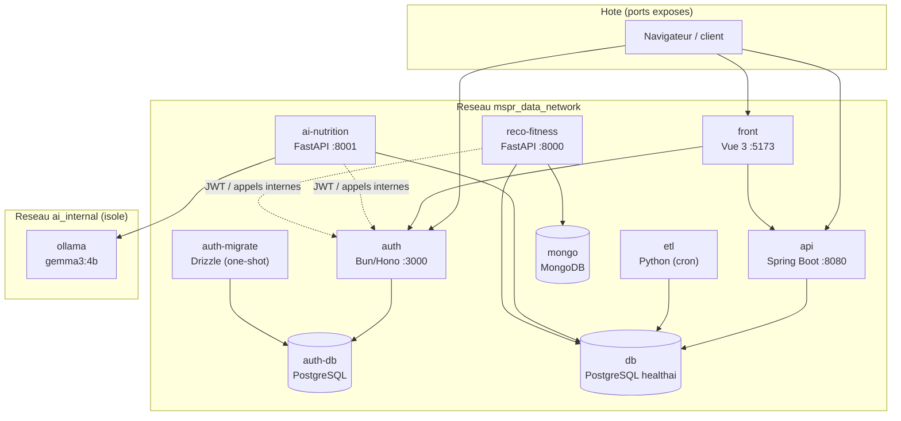
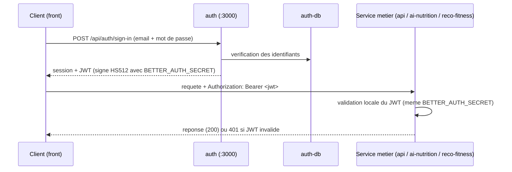
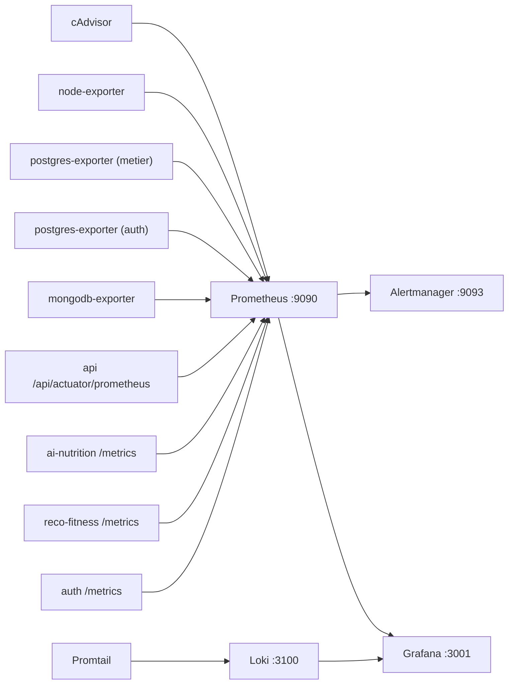

# Vue d'architecture de deploiement (MSPR3 / TPRE601)

Ce document decrit l'architecture de deploiement de la plateforme MSPR HealthAI Coach
telle qu'elle est orchestree par Docker Compose dans le depot `MSPR-Deploy`. Il se
concentre sur les conteneurs, les reseaux, les ports, le flux d'authentification et la
stack d'observabilite. Pour le pas-a-pas de demarrage (prerequis, `bootstrap.sh`,
commandes utiles, depannage), se reporter au `README.md`.

L'application mobile (mini reseau social) est prise en charge separement par un autre
membre de l'equipe : elle est hors du perimetre de ce document.

## 1. Conteneurs et reseaux

La stack compte 8 services applicatifs plus les bases de donnees et le conteneur Ollama.
Deux reseaux bridge :

- `mspr_data_network` : reseau principal, tous les services y communiquent.
- `ai_internal` : reseau isole reservant Ollama a `ai-nutrition` (Ollama n'expose aucun
  port sur l'hote et n'est joignable que par `ai-nutrition`).

Notes de lecture :

- `ai-nutrition` est le seul service rattache aux deux reseaux (`mspr_data_network` +
  `ai_internal`). Ollama n'est present que sur `ai_internal`.
- `auth-migrate` est un conteneur one-shot (`restart: no`) : il applique les migrations
  Drizzle sur `auth-db` puis s'arrete. `auth` ne demarre qu'apres sa completion.
- Les dependances de demarrage sont gerees via `depends_on` + `healthcheck` : `api`,
  `etl`, `ai-nutrition` et `reco-fitness` attendent que `db` soit `healthy` ;
  `reco-fitness` attend aussi `mongo` (healthy) et `auth`.
- Le volume `etl_data` est partage : l'`etl` y ecrit (`/app/data`), l'`api` le lit en
  lecture seule (`/app/etl-data:ro`).

## 2. Ports exposes

Les ports des bases de donnees sont bindes sur `127.0.0.1` (accessibles uniquement depuis
l'hote, pas depuis le reseau). Les services applicatifs exposent leur port sur toutes les
interfaces. Ollama n'expose aucun port.

| Service | Mapping hote -> conteneur | Bind | Acces |
|---------|---------------------------|------|-------|
| front | `5173:5173` | toutes interfaces | Dashboard Vue 3 |
| auth | `3000:3000` | toutes interfaces | Endpoints better-auth |
| api | `8080:8080` | toutes interfaces | API REST + Swagger |
| ai-nutrition | `8001:8001` | toutes interfaces | FastAPI (classification + plan repas) |
| reco-fitness | `8002:8000` | toutes interfaces | FastAPI (recommandations) |
| db (PostgreSQL metier) | `127.0.0.1:5434:5432` | localhost uniquement | base `healthai` |
| auth-db (PostgreSQL auth) | `127.0.0.1:5433:5432` | localhost uniquement | base `auth_db` |
| mongo (MongoDB) | `127.0.0.1:27018:27017` | localhost uniquement | base `reco_fitness` |
| ollama | aucun | reseau `ai_internal` | non joignable depuis l'hote |
| etl, auth-migrate | aucun | reseau interne | pas de port |

Ports ajoutes par l'overlay de monitoring : voir section 4.

## 3. Flux d'authentification (JWT)

L'authentification est entierement deleguee au service `auth` (better-auth). Les services
metier ne gerent pas de comptes : ils valident le JWT a l'aide du secret HMAC partage
`BETTER_AUTH_SECRET` (algorithme HS512), injecte par variable d'environnement dans `auth`,
`api`, `ai-nutrition` et `reco-fitness`.

Points cles :

- La validation du JWT est locale a chaque service (verification de signature), sans
  aller-retour systematique vers `auth`.
- `ai-nutrition` et `reco-fitness` connaissent aussi l'URL interne de `auth`
  (`AUTH_API_URL=http://mspr-auth-service:3000`) pour les appels necessitant le service.
- Le secret est genere par `bootstrap.sh` (il n'y a plus de valeur par defaut versionnee).

## 4. Observabilite (qui scrape quoi)

La supervision est fournie par l'overlay `docker-compose.monitoring.yml`, qui s'ajoute a
la stack sans modifier les services applicatifs. Detail complet dans
`monitoring/README.md`.

Cibles scrapees par Prometheus (`monitoring/prometheus/prometheus.yml`) :

| Job Prometheus | Cible | Donnees |
|----------------|-------|---------|
| `cadvisor` | cadvisor:8080 | metriques par conteneur (CPU, RAM, reseau, IO) |
| `node-exporter` | node-exporter:9100 | metriques de l'hote |
| `postgres-metier` | postgres-exporter:9187 | PostgreSQL base `healthai` |
| `postgres-auth` | postgres-exporter-auth:9187 | PostgreSQL base `auth_db` |
| `mongodb` | mongodb-exporter:9216 | MongoDB base `reco_fitness` |
| `api` | mspr-api:8080 `/api/actuator/prometheus` | HTTP (latence, debit, codes), JVM |
| `ai-nutrition` | mspr-ai-nutrition:8001 `/metrics` | requetes HTTP (RED) |
| `reco-fitness` | mspr-reco-fitness:8000 `/metrics` | requetes HTTP (RED) |
| `auth` | mspr-auth-service:3000 `/metrics` | requetes HTTP (RED) |

Les logs de tous les conteneurs sont collectes par Promtail (via le socket Docker) et
pousses vers Loki, interrogeables dans Grafana. Trois regles d'alerte
(`monitoring/prometheus/alerts.yml`) sont evaluees par Prometheus et routees vers
Alertmanager :

| Alerte | Condition | Severite |
|--------|-----------|----------|
| `CibleInjoignable` | `up == 0` pendant 1 min | critical |
| `ConteneurCpuEleve` | > 0.9 coeur CPU pendant 5 min | warning |
| `ConteneurMemoireElevee` | > 2 Go de RAM pendant 5 min | warning |

Ports ajoutes par l'overlay : Prometheus `9090`, Alertmanager `9093`, Grafana `3001`,
Loki `3100`, cAdvisor `8085`, node-exporter `9100`, postgres-exporter `9187`,
postgres-exporter-auth `9188`, mongodb-exporter `9216`.

> Les metriques applicatives (api, ai-nutrition, reco-fitness, auth) ne sont visibles
> qu'apres reconstruction des images (l'instrumentation vit dans le code source). Les
> metriques d'infrastructure (cAdvisor, node-exporter, exporters de bases) sont actives
> des le lancement.

## 5. Configurations de deploiement et point d'entree

La stack se decline en plusieurs configurations et overlays, tous detailles dans
`CONFIGS.md`. Ils se combinent avec un compose de base (`docker-compose.yml` en mode prod /
images GHCR, ou `docker-compose.dev.yml` en mode dev / build local).

| Configuration | Overlay | Objectif |
|---------------|---------|----------|
| Complete | `docker-compose.monitoring.yml` | tous les services + IA generative + monitoring complet |
| Offline | `docker-compose.offline.yml` | demo sans internet : Ollama local, Auth sans email (`AUTH_OFFLINE`) |
| Performance | `docker-compose.performance.yml` | materiel modeste : limites CPU/RAM, monitoring simplifie, IA lourde optionnelle |
| Exposition publique | `docker-compose.traefik.yml` | reverse proxy Traefik + TLS, routage `*.zespri.duckdns.org` (front, api, auth, ai, reco, grafana) |
| Classification photo | `docker-compose.vision.yml` | `ai-nutrition` sur le backend Mistral vision (route A1) |
| Deploiement continu | `docker-compose.watchtower.yml` | Watchtower : redeploiement automatique des services backend sur nouvelle image GHCR (CD) |

Les trois premieres lignes sont des configurations alternatives ; les trois suivantes sont
des overlays composables. En production sur le serveur, ils sont combines (`monitoring` +
`traefik` + `vision` + `watchtower`) : la plateforme est exposee en HTTPS derriere Traefik
(reseau externe `proxy_net`), supervisee, et maintenue a jour automatiquement par Watchtower
(boucle CI/CD complete, voir `CICD.md`).

Point d'entree unique : `./bootstrap.sh` (mode prod par defaut, `--dev` pour cloner les
sources et builder localement). Le script cree `.env`, genere `BETTER_AUTH_SECRET`,
dechiffre les secrets puis lance la stack. Le pas-a-pas complet est dans le `README.md`.

Resilience : les scripts `scripts/backup.sh`, `scripts/restore.sh` et `scripts/clean.sh`
gerent la sauvegarde (pg_dump des deux bases PostgreSQL + mongodump), la restauration et
la remise a zero.
