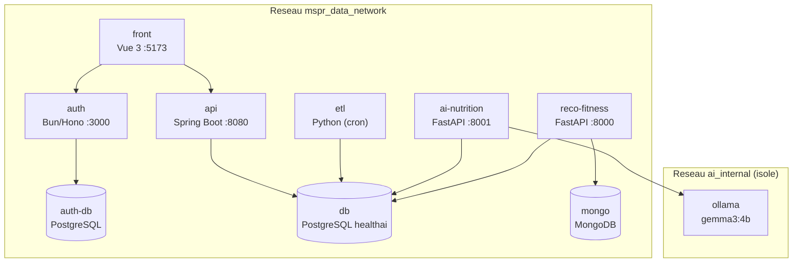
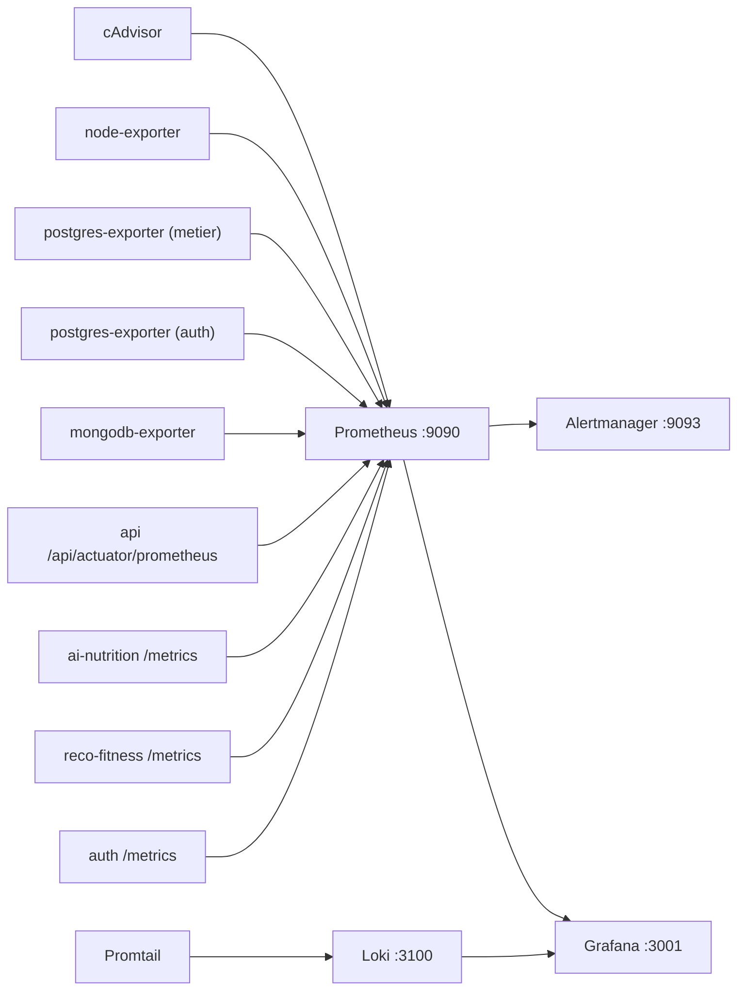
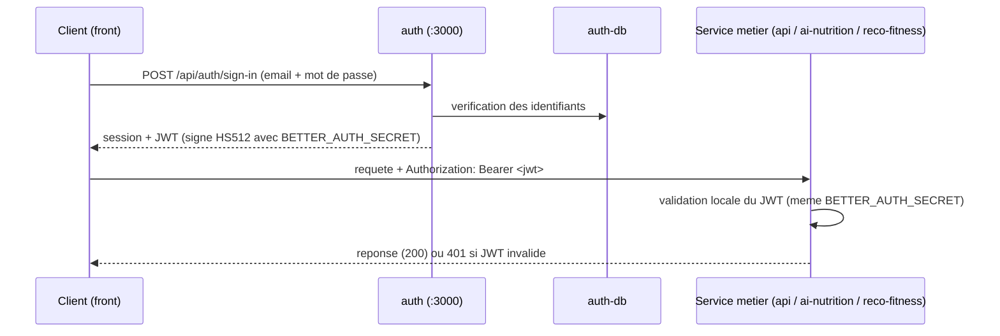

# MSPR3 - TPRE601

## HealthAI Coach : mise en production

Plateforme microservices orchestree en local par Docker Compose

Arthur Poncin

---

# Sommaire

- Rappel du projet et de l'architecture
- Objectifs de la mise en production
- Methodologie agile : 4 sprints + Kanban
- Sprint A : observabilite
- Sprint B : configurations multi-environnement et resilience
- Sprint C : CI/CD et qualite
- Sprint D : securite (OWASP, RGPD, NIST CSF)
- Flux d'authentification JWT
- Plan de demonstration
- Bilan, limites et perspectives

---

# Rappel du projet

Plateforme de coaching sante/fitness issue des MSPR1 et MSPR2, en architecture microservices.

**8 services applicatifs** + bases de donnees + Ollama :

| Service | Stack | Role |
|---------|-------|------|
| db | PostgreSQL | base metier `healthai` |
| auth | Bun / Hono / better-auth | authentification, JWT |
| api | Spring Boot, Java 21 | API REST metier |
| etl | Python | ingestion / chargement des datasets |
| front | Vue 3 / Vite | dashboard admin |
| ai-nutrition | FastAPI + Ollama | classification aliments, plans repas |
| reco-fitness | FastAPI | recommandations fitness |
| mongodb | MongoDB | collections / index reco |

L'application mobile (mini reseau social) est prise en charge par un collegue : hors perimetre.

---

# Architecture : conteneurs et reseaux

Deux reseaux bridge. `ai_internal` isole Ollama : il n'expose aucun port et n'est joignable que par `ai-nutrition`.



---

# Ports exposes

Les ports des bases sont bindes sur `127.0.0.1` (acces depuis l'hote uniquement). Ollama n'expose aucun port.

| Service | Mapping hote -> conteneur | Acces |
|---------|---------------------------|-------|
| front | `5173:5173` | dashboard |
| auth | `3000:3000` | endpoints better-auth |
| api | `8080:8080` | API REST + Swagger |
| ai-nutrition | `8001:8001` | FastAPI |
| reco-fitness | `8002:8000` | FastAPI |
| db | `127.0.0.1:5434:5432` | base `healthai` |
| auth-db | `127.0.0.1:5433:5432` | base `auth_db` |
| mongo | `127.0.0.1:27018:27017` | base `reco_fitness` |
| ollama | aucun | reseau `ai_internal` |

---

# Objectifs de la mise en production

Industrialiser la plateforme issue des MSPR precedentes, cible : un deploiement local orchestre par Docker Compose.

- **Conteneurisation** : chaque service livre comme image Docker
- **Orchestration locale** : un point d'entree unique, `./bootstrap.sh`
- **Observabilite** : metriques, logs centralises, alertes
- **CI/CD** : une chaine par depot, publication d'images sur GHCR
- **Securite** : durcissement des conteneurs, gestion des secrets
- **Configurations** : plusieurs contextes de demonstration (complete, offline, performance)
- **Resilience** : sauvegarde, restauration, remise a zero

---

# Methodologie agile

Approche iterative adaptee a une petite equipe. Pilotage directement dans GitHub (issues, pull requests, Actions). Chaque increment est verifiable de bout en bout : la stack demarre et le nouvel element est demontrable.

Quatre sprints reellement suivis, dans cet ordre :

| Sprint | Theme | Etat |
|--------|-------|------|
| A | Observabilite | Termine |
| B | Configurations multi-environnement + resilience | Termine |
| C | CI/CD et qualite | Termine |
| D | Documentation, securite, gestion de projet | Termine |

**Kanban a 3 colonnes** (issues GitHub) : A faire / En cours / Termine.
Ceremonies allegees : planification, points asynchrones, revue sur la stack locale, retrospective courte.

---

# Sprint A : observabilite (1/3)

**Objectif.** Savoir si les services sont vivants, suivre leurs ressources, centraliser les logs, etre alerte.

Overlay `docker-compose.monitoring.yml` ajoute la stack sans modifier les services applicatifs.

**Composants :**

- Prometheus (metriques), Alertmanager (alertes)
- Grafana (tableaux de bord, point d'entree)
- Loki + Promtail (logs centralises)
- Exporters d'infra : cAdvisor (conteneurs), node-exporter (hote), postgres-exporter x2, mongodb-exporter

**Instrumentation applicative** (dans le code source) :

- API : Actuator / Micrometer (`/api/actuator/prometheus`)
- ai-nutrition, reco-fitness : prometheus-fastapi-instrumentator (`/metrics`)
- auth : `@hono/prometheus` (`/metrics`)

---

# Sprint A : qui scrape quoi (2/3)



Promtail collecte la sortie standard et d'erreur de tous les conteneurs (socket Docker) vers Loki, retention 7 jours, consultables dans Grafana.

---

# Sprint A : alertes et dashboard (3/3)

**Trois regles d'alerte** (`prometheus/alerts.yml`), evaluees par Prometheus et routees vers Alertmanager :

| Alerte | Condition | Duree | Severite |
|--------|-----------|-------|----------|
| `CibleInjoignable` | `up == 0` | 1 min | critical |
| `ConteneurCpuEleve` | > 0,9 coeur CPU | 5 min | warning |
| `ConteneurMemoireElevee` | > 2 Go RAM | 5 min | warning |

En demonstration, aucune notification externe n'est configuree : les alertes se consultent dans Alertmanager.

**Dashboard Grafana** "MSPR HealthAI - Vue stack" provisionne automatiquement : cibles UP, disponibilite par job, CPU / memoire par conteneur, flux de logs.

Note : les metriques applicatives ne sont visibles qu'apres reconstruction des images (l'instrumentation vit dans le code source).

---

# Sprint B : configurations multi-environnement (1/2)

**Objectif.** Rendre la stack adaptable a plusieurs contextes de demonstration. Trois configurations via overlays Compose (`CONFIGS.md`).

| Configuration | Overlay | Objectif |
|---------------|---------|----------|
| complete | `docker-compose.monitoring.yml` | tous services + IA generative + monitoring complet |
| offline | `docker-compose.offline.yml` | demo sans internet |
| performance | `docker-compose.performance.yml` | materiel modeste : limites CPU/RAM, monitoring reduit |

- **offline** : LLM force sur Ollama local (aucun appel Mistral), Auth sans verification email (`AUTH_OFFLINE=true`, aucun appel Resend).
- **performance** : limites CPU/RAM par service, IA lourde (`ai-nutrition` + `ollama`) omise par defaut (repli sur la matrice statique), monitoring reduit a l'essentiel.

---

# Sprint B : resilience (2/2)

Trois scripts dans `scripts/`, operant sur les conteneurs en cours d'execution :

| Script | Action |
|--------|--------|
| `backup.sh` | dump horodate : `pg_dump` metier + `pg_dump` auth + `mongodump`, sortie dans `backups/<timestamp>/` |
| `restore.sh` | restaure la derniere sauvegarde ou un chemin precis (`psql`, `mongorestore --drop`) |
| `clean.sh` | remise a zero (supprime les volumes) |

```bash
./scripts/backup.sh                  # dump horodate
./scripts/restore.sh                 # derniere sauvegarde
./scripts/restore.sh backups/XXXX    # sauvegarde precise
./scripts/clean.sh                   # remise a zero
```

Sauvegardes locales et horodatees, dossier `backups/` non versionne.
Politique `restart: unless-stopped` sur les services.

---

# Sprint C : CI/CD par depot (1/3)

**Objectif.** Chaque depot construit, teste et publie automatiquement son image, avec des garde-fous de qualite.

Une chaine GitHub Actions par depot (8 services) : lint selon la techno, tests + couverture, build de l'image, publication sur GHCR (`ghcr.io/whitefoxxyt/mspr-<service>`).

```text
commit/push (branche par defaut ou tag vX.Y.Z)
   |--> lint (selon la techno)
   |--> tests + couverture
   |--> build de l'image Docker
   v
publication sur GHCR
   v
deploiement local : ./bootstrap.sh -> docker compose up -d
```

Publication conditionnee : uniquement sur `push` (jamais sur les pull requests) et seulement si lint et tests passent. Workflows `docker-publish` appeles via `workflow_call`.

---

# Sprint C : qualite et couverture (2/3)

**Couverture imposee a 80 %** sur deux services :

| Service | Outil | Seuil | Enforcement |
|---------|-------|-------|-------------|
| API | JaCoCo | 80 % lignes + branches | bloquant (`mvnw verify`, regle `jacoco-check`) |
| Reco-Fitness | pytest-cov | 80 % lignes | objectif verifie sur le rapport |
| AI-Nutrition | pytest-cov | 80 % (cible) | mesure, pas d'enforcement strict |
| Auth, ETL, Front | bun test / pytest / Vitest | - | mesure ou tests seuls |

**SonarCloud** sur l'API : etape `./mvnw -B verify sonar:sonar` declenchee automatiquement des que le secret `SONAR_TOKEN` est present, ignoree sinon sans casser le pipeline. L'API embarque aussi un environnement Sonar local (`docker-compose.sonar.yml`).

**Strategie de tags** (`docker/metadata-action`) : branche, semver sur tags `vX.Y.Z`, SHA court (tracabilite), `latest` depuis la branche par defaut. Le mode prod tire `:latest`.

---

# Sprint C : durcissement des conteneurs (3/3)

Volet securite operationnelle de l'industrialisation, applique via les reglages communs Compose (`x-hardening`).

- **Utilisateur non-root** : les 6 services applicatifs (defini dans leurs Dockerfile)
- **`no-new-privileges:true`** sur tous les services
- **`HEALTHCHECK`** present sur chaque service applicatif
- **Ports des bases bindes sur `127.0.0.1`** (5433 / 5434 / 27018), non exposes hors de l'hote
- **Rotation des logs** json-file (`max-size: 10m`, `max-file: 3`)

**Gestion des secrets :**

- `bootstrap.sh` genere `BETTER_AUTH_SECRET` (`openssl rand -base64 64`) et les mots de passe des bases (plus de defaut `password` en exploitation)
- Cles API tierces (Resend, Mistral) chiffrees au repos : `secrets/*.enc` (`aes-256-cbc`, sel + PBKDF2 100000 iterations), dechiffrees au demarrage
- `.env` exclu du versionnement (`.gitignore`)

---

# Sprint D : securite - OWASP Top 10 (1/2)

Confrontation de l'existant a OWASP Top 10 (2021). Document factuel : seuls les controles reellement presents sont decrits.

| Categorie | Etat | Element cle |
|-----------|------|-------------|
| A01 Broken Access Control | Partiel | JWT valide par les services via secret partage |
| A02 Cryptographic Failures | Partiel | JWT HS512, cles API chiffrees au repos |
| A03 Injection | Partiel | JPA / requetes parametrees, validation d'entrees |
| A04 Insecure Design | Partiel | Segmentation reseau, separation des bases |
| A05 Security Misconfiguration | Partiel | Non-root, `no-new-privileges`, bases sur `127.0.0.1` |
| A06 Composants obsoletes | Partiel | Images publiees par la CI (pas de scan d'images) |
| A07 Auth Failures | Partiel | better-auth (comptes, sessions, JWT) |
| A08 Data Integrity | Partiel | Images tracables par SHA, publication conditionnee |
| A09 Logging & Monitoring | Partiel | Stack d'observabilite, logs centralises, 3 alertes |
| A10 SSRF | Non evalue | Pas de controle specifique identifie |

---

# Sprint D : RGPD et NIST CSF (2/2)

**RGPD - anonymisation et minimisation :**

- Datasets sources anonymises : ni PII identifiante, ni identifiant commun
- Table `users` supprimee de la base metier (migration `V7__drop_users_table.sql`), retrait des FK `user_id`
- Comptes (email, mot de passe) isoles dans la base auth dediee (`auth_db`, port 5433 sur `127.0.0.1`)

**NIST Cybersecurity Framework :**

| Fonction | Couverture | Elements |
|----------|------------|----------|
| Identify | Partiel | Inventaire des services, cartographie reseau |
| **Protect** | Oui | JWT, durcissement conteneurs, isolement reseau, secrets, CORS, rate limiting |
| **Detect** | Oui | Prometheus, Grafana, Loki, exporters, 3 alertes |
| Respond | Partiel | Alertmanager regroupe (pas de routage de notification) |
| **Recover** | Oui | Scripts backup / restore / clean, `restart: unless-stopped` |

---

# Flux d'authentification JWT

Authentification entierement deleguee au service `auth` (better-auth). Les services metier valident le JWT localement via le secret HMAC partage `BETTER_AUTH_SECRET` (HS512).



Validation locale a chaque service (verification de signature), sans aller-retour systematique vers `auth`. Le secret est genere par `bootstrap.sh`, plus de valeur par defaut versionnee.

---

# Plan de demonstration

1. **Demarrage** : `./bootstrap.sh` (cree `.env`, genere `BETTER_AUTH_SECRET`, dechiffre les secrets, lance `docker compose up -d`)
2. **Etat de la stack** : `docker compose ps` (statut + sante des conteneurs)
3. **Healthchecks** :
   ```bash
   curl http://localhost:8080/api/actuator/health
   curl http://localhost:8001/health
   curl http://localhost:8002/health
   ```
4. **Observabilite** : Grafana (http://localhost:3001), tableau de bord "MSPR HealthAI - Vue stack" ; cibles UP dans Prometheus
5. **CI/CD** : un run GitHub Actions vert et l'image publiee sur GHCR
6. **Resilience** : `./scripts/backup.sh` puis `./scripts/restore.sh`

---

# Bilan : ce qui est en place

- **Conteneurisation et orchestration** : 8 services, point d'entree unique `bootstrap.sh`, 3 configurations
- **Observabilite** : metriques (infra + applicatif) et logs centralises, 3 alertes, dashboard provisionne
- **CI/CD** : une chaine par depot, publication GHCR conditionnee, images tracables par SHA
- **Qualite** : couverture 80 % (API, Reco-Fitness), SonarCloud cote API
- **Securite** : durcissement homogene des conteneurs, secrets generes / chiffres, bases sur `127.0.0.1`
- **RGPD** : datasets anonymises, table `users` supprimee (V7)
- **Resilience** : scripts backup / restore / clean

**Limites assumees :**

- Pas de scan de vulnerabilite d'images (Trivy/Grype) ; deploiement sur `:latest`
- Pas de TLS sur les services exposes (HTTP en local)
- Grafana en `admin/admin` par defaut (surchargeable via `GRAFANA_ADMIN_PASSWORD`)
- Endpoints de metriques non authentifies (acceptable en demo locale)

---

# Perspectives

Pistes d'amelioration realistes identifiees dans l'analyse de securite :

- **Scan de vulnerabilite d'images** (Trivy/Grype) en CI et figer le tag de deploiement plutot que `:latest`
- **TLS** sur les services exposes pour un deploiement hors poste local
- **Authentifier les endpoints de metriques** ou les restreindre au reseau de supervision, changer le mot de passe Grafana
- **Externaliser les sauvegardes** et automatiser un test de restauration
- **Plan de reponse a incident** et canal de notification Alertmanager (fonction Respond)
- **Raccordement du backend de l'application mobile** du collegue (mini reseau social), aujourd'hui hors perimetre

---

# Conclusion

- MSPR3 : mise en production locale de la plateforme HealthAI Coach (8 services microservices)
- Quatre sprints livres : observabilite, configurations / resilience, CI/CD / qualite, documentation / securite
- Stack orchestree par Docker Compose, un point d'entree (`bootstrap.sh`), images publiees sur GHCR
- Securite confrontee a OWASP Top 10, RGPD et NIST CSF, avec limites assumees

## Questions
